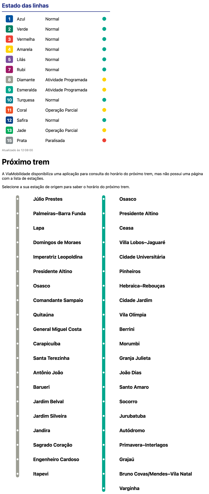

# Transporte Metropolitano

Este projeto é uma aplicação Angular que exibe informações sobre o estado das linhas, horários e outras informações relevantes do transporte metropolitano de São Paulo.

Além disso, ao fornecer backlinks, o projeto auxilia na indexação das páginas de "Próximo Trem" da ViaMobilidade, que não estavam visíveis para mecanismos de busca antes da publicação do site.

Disponível em: https://metro.yudi.com.br

