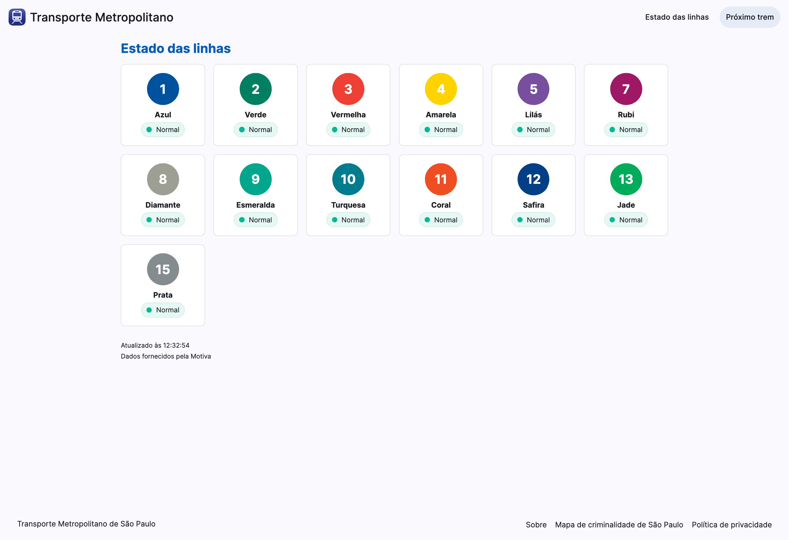

# Metrô

Este projeto é uma aplicação Angular que exibe informações sobre o estado das linhas do transporte metropolitano de São Paulo.

Ele utiliza uma API pública da ViaMobilidade para obter dados atualizados sobre as linhas, incluindo status, horários e outras informações relevantes.

Além disso, como o objetivo principal, o projeto auxilia na indexação das páginas de "Próximo Trem" da ViaMobilidade, que não estavam visíveis para mecanismos de busca antes da publicação deste site.

Disponível em: https://metro.yudi.com.br

